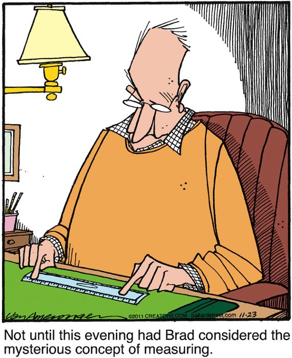

!SLIDE transition=scrollLeft
    @@@ Ruby

    class Integer
      def sqrt_prime?
        (2..Math.sqrt(self).floor).all? { |i| (self % i).nonzero? }
      end
    end

     

!SLIDE
    @@@ Ruby

    require 'prime'

    class Integer
      def sqrt_prime?
        (2..Math.sqrt(self).floor).all? { |i| (self % i).nonzero? }
      end
    end

     

!SLIDE
    @@@ Ruby
    require 'benchmark'
    require 'prime'

    class Integer
      def sqrt_prime?
        (2..Math.sqrt(self).floor).all? { |i| (self % i).nonzero? }
      end
    end

    range = 2..1_000_000

    Benchmark.bmbm do |bench|
      bench.report('sqrt:')   { range.each &:sqrt_prime? }
      bench.report('stdlib:') { range.each &:prime?      }
    end

!SLIDE commandline incremental transition=scrollLeft
    $ ruby prime_bench.rb
    Rehearsal -------------------------------------------
    sqrt:    24.740000   0.000000  24.740000 ( 24.833979)
    stdlib:  35.340000   0.000000  35.340000 ( 35.377147)
    --------------------------------- total: 60.080000sec

                  user     system      total        real
    sqrt:    24.590000   0.000000  24.590000 ( 24.606882)
    stdlib:  36.790000   0.000000  36.790000 ( 36.827468)

!SLIDE center transition=scrollRight

[Ballard Street](http://www.gocomics.com/ballardstreet/2011/11/23)
